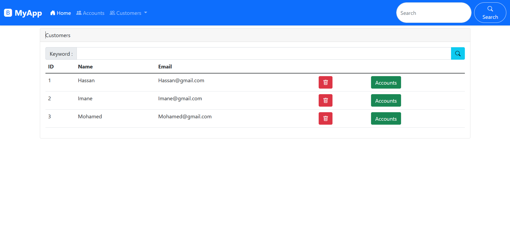
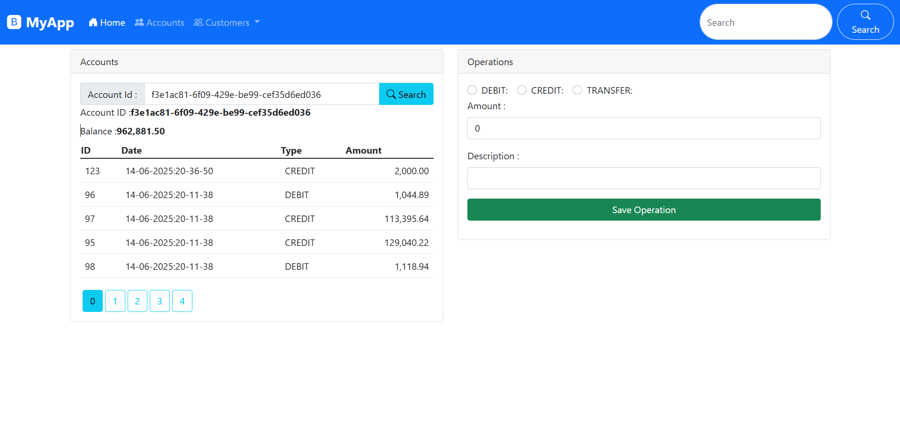
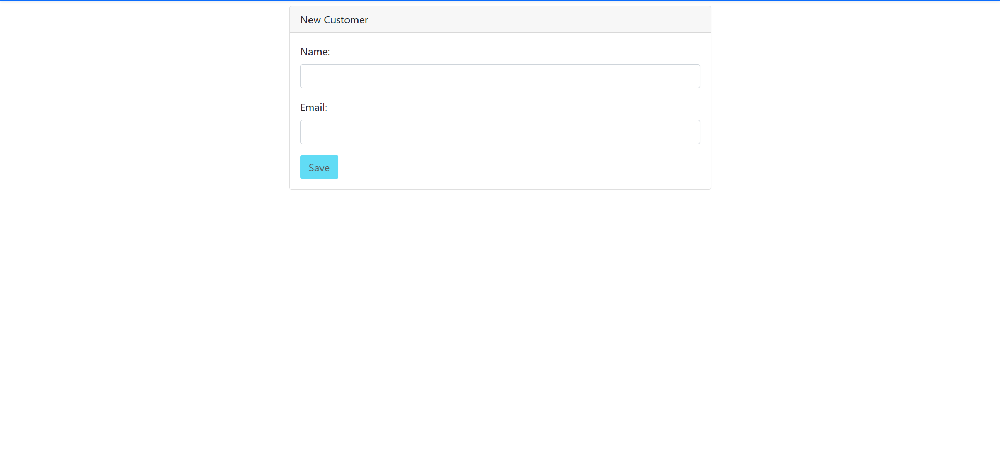

# 💳 MyApp – Gestion Bancaire

Application web complète de gestion de comptes bancaires, construite avec **Spring Boot** (backend) et **Angular** (frontend). Elle permet de gérer des clients, leurs comptes bancaires, et les opérations associées (crédit, débit, transfert).

---

## 🛠️ Technologies utilisées

### Backend – Java Spring Boot (JEE)
- Spring Web
- Spring Data JPA
- Spring Boot DevTools
- H2 Database (ou autre selon config)
- REST API

### Frontend – Angular
- Angular CLI
- TypeScript
- Bootstrap / CSS personnalisé
- HTTPClient pour appels API REST

---

## 📷 Aperçu de l'application

### 🧑‍💼 Gestion des clients
- Ajouter, supprimer et rechercher des clients
- Affichage de la liste des clients

### 🏦 Gestion des comptes
- Affichage du solde
- Historique des opérations (paginations, types, dates)
- Effectuer des opérations : **crédit**, **débit**, **transfert**

### ➕ Ajouter un client

---

## ⚙️ Fonctionnalités principales

- 🔍 **Recherche de comptes** par ID
- 💰 **Effectuer des opérations bancaires** (crédit, débit, transfert)
- 📊 **Consultation du solde** en temps réel
- 👥 **Gestion des clients** avec CRUD complet
- 📄 **Historique paginé** des transactions

---

## 🚀 Lancer le projet
